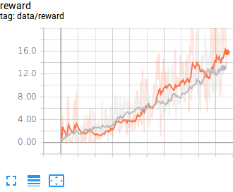
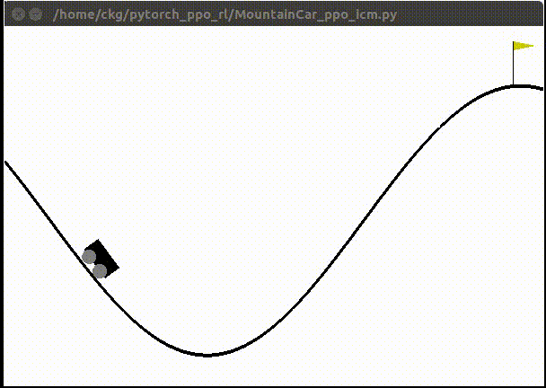
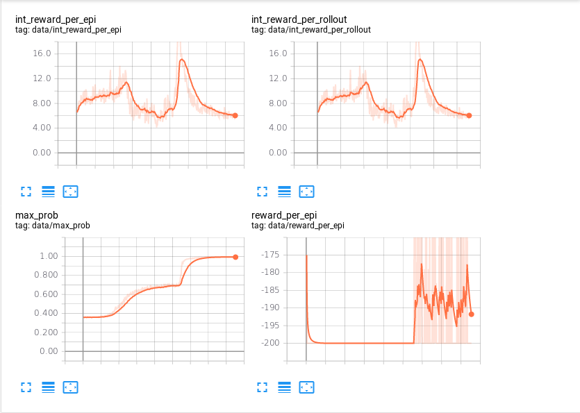
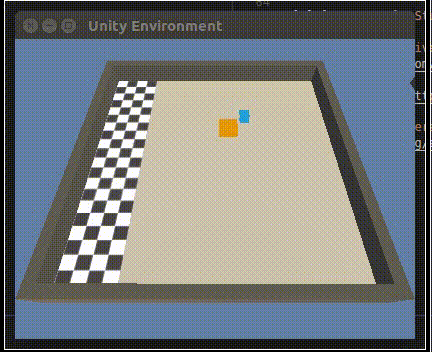
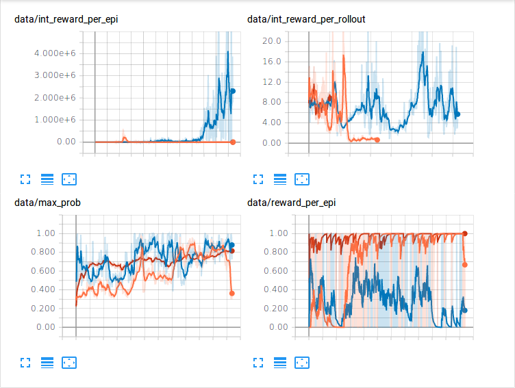
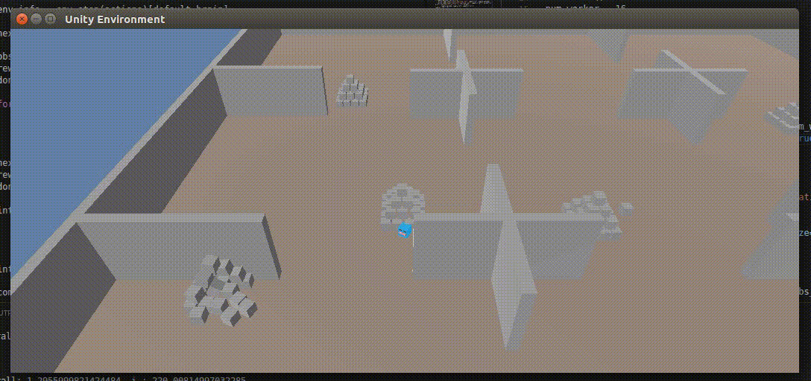
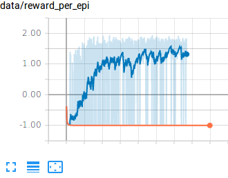
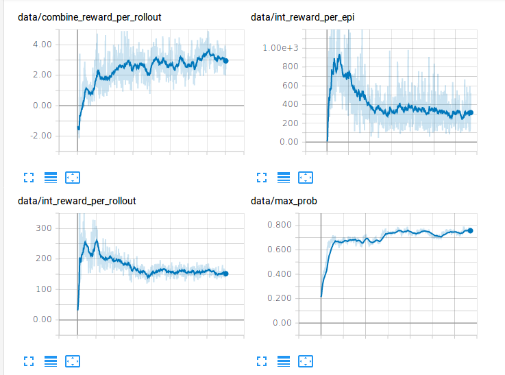

# This Repository is Reinforcement Learning related with PPO

This Repository is Reinforcece Learning Implementation related with PPO.
The framework used in this Repository is Pytorch. The multi-processing method is basically built in. The agents are trained by PAAC(Parallel Advantage Actor Critic) strategy.  

## 1. Multi-processing MLP Proximal Policy Optimization  

* Script : LunarLander_ppo.py  
* Environment : LunarLander-v2  
* Orange : 8 Process, Blue : 4 Process, Red : 1 Process

###### LunarLander-v2

  

## 2. Multi-processing CNN Proximal Policy Opimization

* Script : Breakout_ppo.py
* Environment : BreakoutDeterministic-v4
* Red: 8 Process, Blue: 4 Process, Orange: 1 Process

###### BreakoutDeterministic-v4

  
  
  

# 3. Multi-processing CNN Proximal Policy Opitimization with Intrinsic Curiosity Module

* Script : Breakout_ppo_icm.py
* Environment : BreakoutNoFrameskip-v4(handled by custom environment)
* With no environment Reward
* Because the game initial key is not selected, the peak point and performance drop is generated.
* Left : Comparison between (extrinsic reward and intrinsic, oragne) and (only intrinsic reward, gray), the average of three times of experiment
* Right : only intrinsic reward
* 32 process

###### BreakoutNoFrameskip-v4(handled by custom environment)

  
  

# 3. Multi-processing Mlp Proximal Policy Opitimization with Intrinsic Curiosity Module

* Script : MountainCar_ppo_icm.py
* Environment : MountainCart-v0
* With no environment Reward
* 32 process

###### MountainCart-v0

  
  

# 4. Unity MLAgents Mlp Proximal Policy Optimization with Intrinsic Curiosity Module

* Script : PushBlock_ppo_icm.py
* Environment : PushBlock
* 32 Environment, PAAC
* orange : 0.5int + 0.5ext, blue : only int, Red : only ext
* reward shaping for sparse-reward environment : sucess - 1, others - 0
* The environment has not sparsed-reward property even if the reward is engineered to two categories(0, 1)

###### PushBlock

  
  

# 5. Unity MLAgents Mlp Proximal Policy Optimization with Intrinsic Curiosity Module

* Script : Pyramid_ppo_icm.py
* Environment : Pyramid
* 16 Environment, PAAC
* orange : only ext, blue : 0.01int + 0.99ext

###### Pyramid

  
  
  

## Reference

[1] [mario_rl](https://github.com/jcwleo/mario_rl)

[2] [Proximal Policy Optimization](https://arxiv.org/abs/1707.06347)

[2] [Efficient Parallel Methods for Deep Reinforcement Learning](https://arxiv.org/abs/1705.04862)

[3] [High-Dimensional Continuous Control Using Generalized Advantage Estimation](https://arxiv.org/abs/1506.02438)

[4] [Curiosity-driven Exploration by Self-supervised Prediction](https://arxiv.org/abs/1705.05363)

[5] [Large-Scale Study of Curiosity-Driven Learning](https://arxiv.org/abs/1808.04355)

[6] [curiosity-driven-exploration-pytorch](https://github.com/jcwleo/curiosity-driven-exploration-pytorch)

[7] [ml-agents](https://github.com/Unity-Technologies/ml-agents)

[8] [Unity: A General Platform for Intelligent Agents](https://arxiv.org/abs/1809.02627)

[9] [Solving sparse-reward tasks with Curiosity](https://blogs.unity3d.com/kr/2018/06/26/solving-sparse-reward-tasks-with-curiosity/)